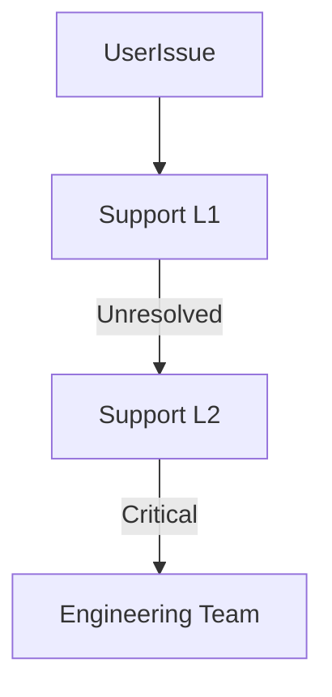

# Support Guide

## Overview
- This section outlines the primary goals and scope of Support Guide.

## Prerequisites
- Familiarity with basic Support Guide concepts and system requirements is recommended.

## Setup
- Follow these steps to configure and enable Support Guide in your environment.

## Usage
- Instructions and examples for applying Support Guide in day-to-day operations.

## References
- Additional resources and documentation about Support Guide for further learning.

## Support Tiers
- **L1 (Basic Support)** → common issues, password resets, how-to guides.
- **L2 (Technical Support)** → bug reports, module errors, integrations.
- **L3 (Engineering Escalation)** → complex issues, outages, data recovery.

## Channels
- In-app chat.
- Email support.
- Emergency hotline for enterprise tenants.

## SLA
- L1: response within 8 hours.
- L2: response within 4 hours.
- L3: immediate escalation (24/7).

## Escalation Matrix

