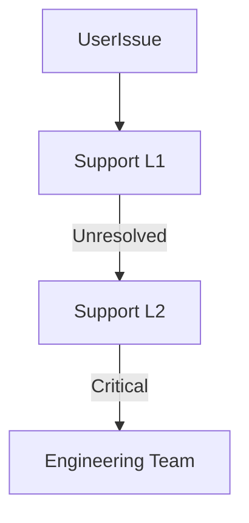

# Support Guide

## Overview
- TBD

## Prerequisites
- TBD

## Setup
- TBD

## Usage
- TBD

## References
- TBD

## Support Tiers
- **L1 (Basic Support)** → common issues, password resets, how-to guides.
- **L2 (Technical Support)** → bug reports, module errors, integrations.
- **L3 (Engineering Escalation)** → complex issues, outages, data recovery.

## Channels
- In-app chat.
- Email support.
- Emergency hotline for enterprise tenants.

## SLA
- L1: response within 8 hours.
- L2: response within 4 hours.
- L3: immediate escalation (24/7).

## Escalation Matrix

