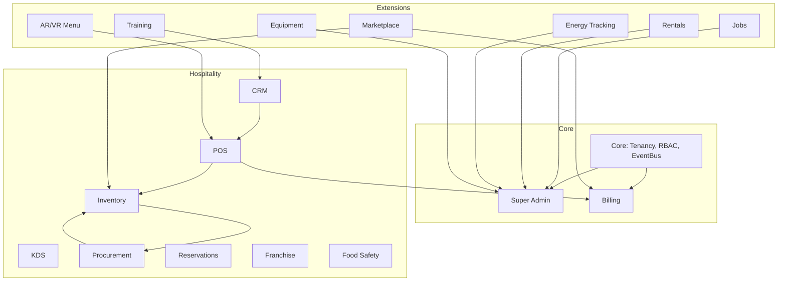

# EliteSaaS Technical Guide

## 1. Architecture Overview
- Modular SaaS built with Laravel 12 + PHP 8.4.  
- Multi-tenant isolation: per-database or schema.  
- RBAC with Spatie permissions.  
- Event Bus for inter-module communication.  
- Feature Flags for tenant-specific modules.  

## Diagram

## 2. Core Layers
- Core: tenancy, RBAC, events.  
- Governance: Super Admin + Billing.  
- Hospitality Ops: POS, Inventory, CRM, KDS, Procurement.  
- Extensions: Marketplace, Jobs, Rentals, AR/VR, etc.  

## 3. API Standards
- REST + GraphQL.  
- JSON responses with error handling.  
- Event-driven architecture for modules.  

## 4. Database Strategy
- Hybrid: Central DB (Super Admin, Marketplace), Tenant DB (POS, Inventory).  
- Audit logs per tenant.  
- Soft delete + versioning.  

## 5. Security
- JWT + OAuth2.  
- Encrypted storage.  
- GDPR/PCI DSS/HIPAA compliance.  

## 6. UI/UX
- Vue3 + Inertia + Tailwind + Pinia.  
- PWA (offline mode).  
- i18n + RTL.  
- Theming per tenant.  

## 7. Testing
- Unit tests with Pest.  
- Integration tests POS → Inventory.  
- E2E tests with Cypress.  

## 8. Performance
- Redis caching.  
- Queue workers with Horizon.  
- DB sharding/replicas.  

## 9. DevOps
- Docker Compose for local.  
- Kubernetes for production.  
- CI/CD pipelines with GitHub Actions.  
