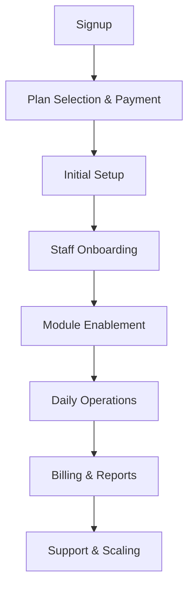

# Tenant Journey

## Overview
- This section outlines the primary goals and scope of Tenant Journey.

## Prerequisites
- Familiarity with basic Tenant Journey concepts and system requirements is recommended.

## Setup
- Follow these steps to configure and enable Tenant Journey in your environment.

## Usage
- Instructions and examples for applying Tenant Journey in day-to-day operations.

## References
- Additional resources and documentation about Tenant Journey for further learning.

## Step 1: Signup
- Tenant signs up with email, company name, domain.
- System generates tenant schema/database.
- Assigns default roles (Owner, Manager).

## Step 2: Plan Selection & Payment
- Tenant chooses subscription plan.
- Redirect to Stripe/Paddle for payment.
- Upon confirmation → activate modules for tenant.

## Step 3: Initial Setup
- Configure branding (logo, colors).
- Import menu/inventory templates.
- Seed default roles and permissions.
- Connect hardware (printers, KDS, scanners).

## Step 4: Staff Onboarding
- Tenant invites staff by email.
- Assign roles (cashier, waiter, chef, manager).
- Staff receive credentials + onboarding guide.

## Step 5: Module Enablement
- Tenant Admin enables/disables modules (CRM, Reservations, Marketplace).
- Modules load dynamically via feature flags.

## Step 6: Daily Operations
- POS handles orders.
- Inventory deducts stock automatically.
- CRM tracks customers & loyalty.
- Reservations sync with POS.

## Step 7: Billing & Reports
- Subscriptions auto-renew monthly.
- Billing generates invoices and sends reminders.
- Reports module aggregates tenant KPIs.

## Step 8: Support & Scaling
- In-app support chat + knowledge base.
- Option to upgrade plan for more features.
- Scaling with load balancer & HA infra.

---

## Tenant Journey Flow

## Related Docs
- [README.md](README.md)
- [MASTER_INDEX.md](MASTER_INDEX.md)

## Changelog
- Added Last Updated metadata

Last Updated: 2025-09-11 by ChatGPT
