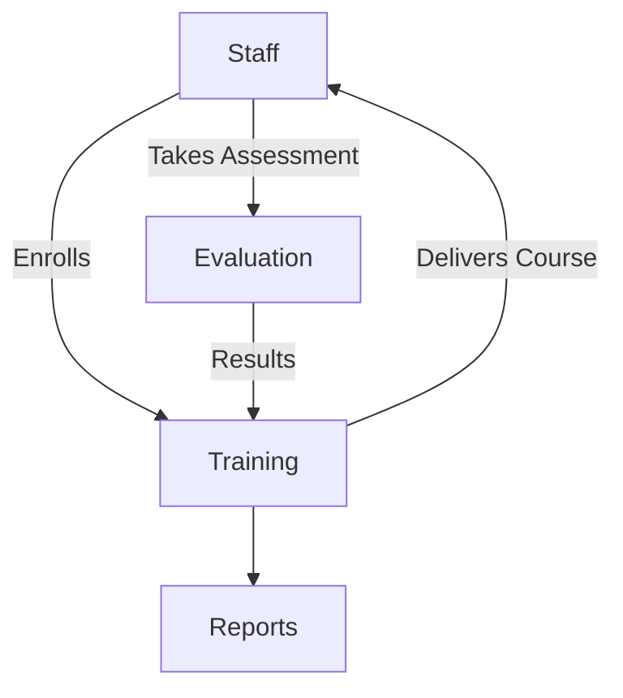

# Training Module

## Overview
- This section outlines the primary goals and scope of Training.

## Prerequisites
- Familiarity with basic Training concepts and system requirements is recommended.

## Setup
- Follow these steps to configure and enable Training in your environment.

## Usage
- Instructions and examples for applying Training in day-to-day operations.

## References
- Additional resources and documentation about Training for further learning.

## Overview
Manages staff training programs, courses, and evaluations.

## Features
- Create and assign training courses.  
- Track staff progress.  
- Evaluate performance with quizzes and assessments.  
- Generate training reports.  

## Workflow

## API
- `GET /api/training/courses` – List available courses.  
- `POST /api/training/enroll` – Enroll staff to course.  
- `POST /api/training/evaluate` – Submit evaluation results.  

## Security
- Only managers can assign courses.  
- Staff access limited to their own records.  

## Future Enhancements
- Gamification (badges, leaderboards).  
- AI-driven personalized training paths.

## Related Docs
- [README.md](README.md)
- [MASTER_INDEX.md](MASTER_INDEX.md)

## Changelog
- Added Last Updated metadata

Last Updated: 2025-09-11 by ChatGPT
