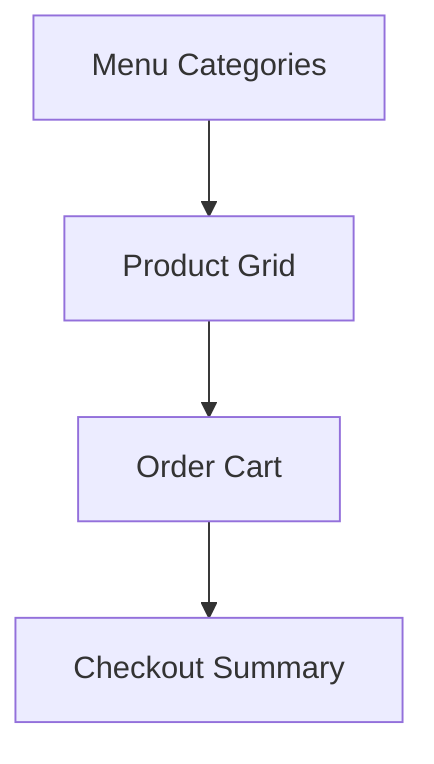
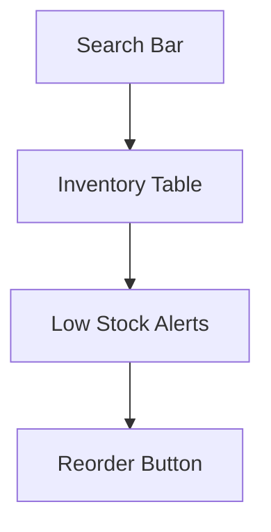
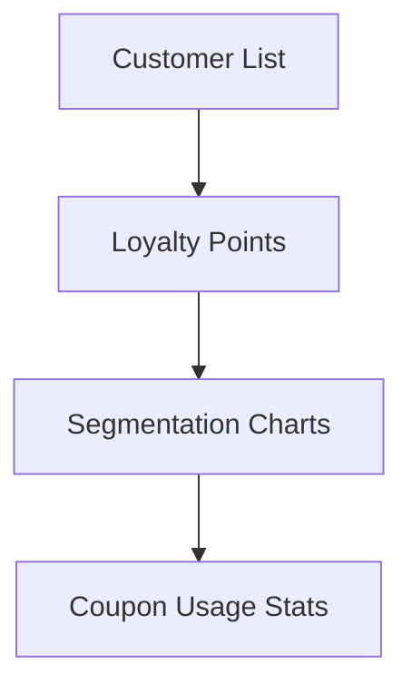
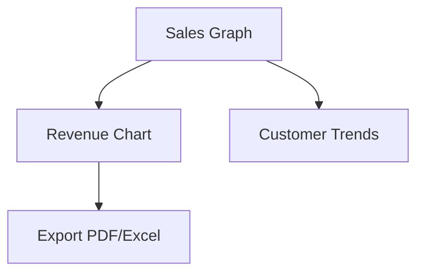

# UI/UX Design Guide

## Overview
- TBD

## Prerequisites
- TBD

## Setup
- TBD

## Usage
- TBD

## References
- TBD

## Design System

### Colors
- **Primary:** Blue (#2563eb)
- **Secondary:** Green (#16a34a)
- **Neutral:** Gray (#6b7280)
- **Accent:** Orange (#f97316)
- Support for light/dark mode.

### Typography
- Headings: Inter, Bold
- Body: Inter, Regular
- Monospace (code, logs): JetBrains Mono

### Components
- Buttons: primary, secondary, ghost, destructive.
- Inputs: with validation states (error, success).
- Tables: sortable, filterable, paginated.
- Cards: rounded, with shadow for dashboard stats.

---

## Wireframes & Mockups

### POS Screen

### Inventory Screen

### CRM Dashboard

### Reports Screen

---

## UX Flows

### Order Flow (Customer → POS → KDS → Billing → Reports)
1. Customer places order → POS.
2. POS sends order → KDS.
3. Chef updates status → POS.
4. POS triggers stock deduction → Inventory.
5. POS → Billing generates invoice.
6. All data aggregated into Reports.

### Reservation Flow
1. Customer books table → Reservations.
2. Reservation confirmed → CRM.
3. POS auto-links reservation to order.

---

## Accessibility
- WCAG 2.1 AA compliant.
- Keyboard shortcuts for POS.
- Screen reader friendly.

