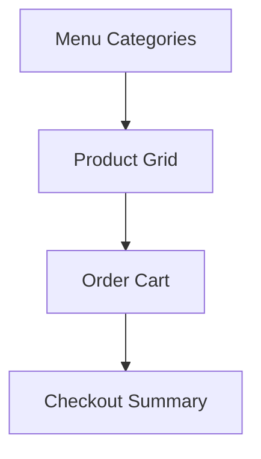
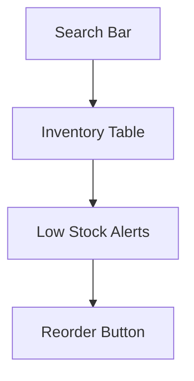
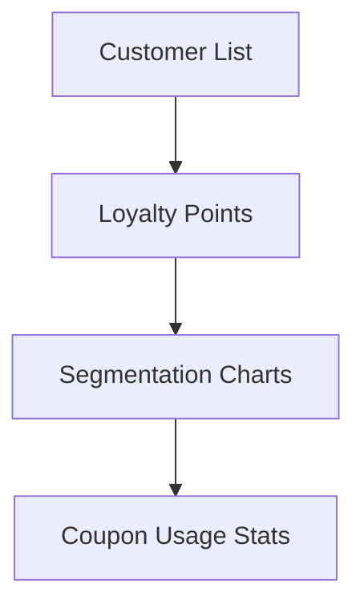
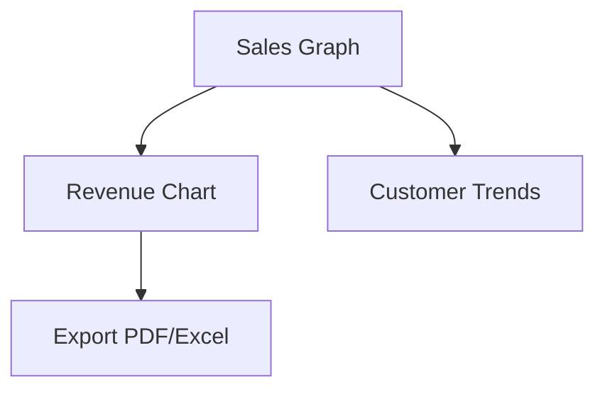

<!-- START doctoc generated TOC please keep comment here to allow auto update -->
<!-- DON'T EDIT THIS SECTION, INSTEAD RE-RUN doctoc TO UPDATE -->
## Table of Contents

- [UI/UX Design Guide](#uiux-design-guide)
  - [Overview](#overview)
  - [Prerequisites](#prerequisites)
  - [Setup](#setup)
  - [Usage](#usage)
  - [References](#references)
  - [Design System](#design-system)
    - [Colors](#colors)
    - [Typography](#typography)
    - [Components](#components)
  - [Wireframes & Mockups](#wireframes--mockups)
    - [POS Screen](#pos-screen)
    - [Inventory Screen](#inventory-screen)
    - [CRM Dashboard](#crm-dashboard)
    - [Reports Screen](#reports-screen)
  - [UX Flows](#ux-flows)
    - [Order Flow (Customer → POS → KDS → Billing → Reports)](#order-flow-customer-%E2%86%92-pos-%E2%86%92-kds-%E2%86%92-billing-%E2%86%92-reports)
    - [Reservation Flow](#reservation-flow)
  - [Accessibility](#accessibility)
  - [Related Docs](#related-docs)

<!-- END doctoc generated TOC please keep comment here to allow auto update -->

# UI/UX Design Guide

## Overview
- This section outlines the primary goals and scope of Ui Ux Guide.

## Prerequisites
- Familiarity with basic Ui Ux Guide concepts and system requirements is recommended.

## Setup
- Follow these steps to configure and enable Ui Ux Guide in your environment.

## Usage
- Instructions and examples for applying Ui Ux Guide in day-to-day operations.

## References
- Additional resources and documentation about Ui Ux Guide for further learning.

## Design System

### Colors
- **Primary:** Blue (#2563eb)
- **Secondary:** Green (#16a34a)
- **Neutral:** Gray (#6b7280)
- **Accent:** Orange (#f97316)
- Support for light/dark mode.

### Typography
- Headings: Inter, Bold
- Body: Inter, Regular
- Monospace (code, logs): JetBrains Mono

### Components
- Buttons: primary, secondary, ghost, destructive.
- Inputs: with validation states (error, success).
- Tables: sortable, filterable, paginated.
- Cards: rounded, with shadow for dashboard stats.

---

## Wireframes & Mockups

### POS Screen

### Inventory Screen

### CRM Dashboard

### Reports Screen

---

## UX Flows

### Order Flow (Customer → POS → KDS → Billing → Reports)
1. Customer places order → POS.
2. POS sends order → KDS.
3. Chef updates status → POS.
4. POS triggers stock deduction → Inventory.
5. POS → Billing generates invoice.
6. All data aggregated into Reports.

### Reservation Flow
1. Customer books table → Reservations.
2. Reservation confirmed → CRM.
3. POS auto-links reservation to order.

---

## Accessibility
- WCAG 2.1 AA compliant.
- Keyboard shortcuts for POS.
- Screen reader friendly.

## Related Docs
- [README.md](README.md)
- [MASTER_INDEX.md](MASTER_INDEX.md)

