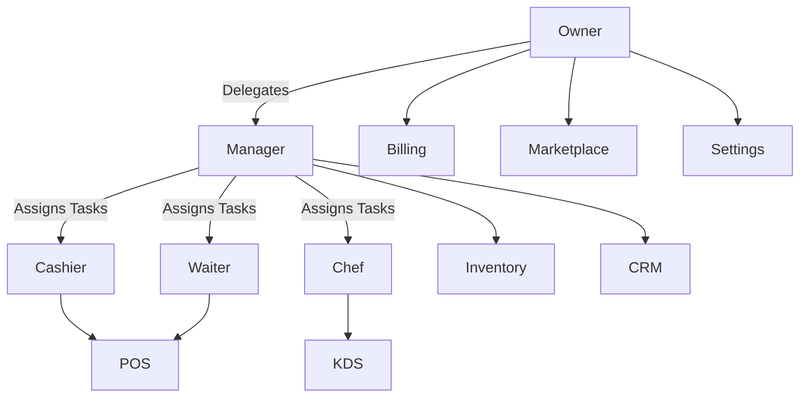

# User Roles & Permissions

## Overview
- This section outlines the primary goals and scope of User Roles.

## Prerequisites
- Familiarity with basic User Roles concepts and system requirements is recommended.

## Setup
- Follow these steps to configure and enable User Roles in your environment.

## Usage
- Instructions and examples for applying User Roles in day-to-day operations.

## References
- Additional resources and documentation about User Roles for further learning.

## Overview
Defines the access control matrix for different user roles in the system.  
Roles are enforced with RBAC at both tenant and module level.

---

## Roles
- **Owner** → Full access across all modules, billing, and settings.  
- **Manager** → Full access to operations (POS, Inventory, CRM), limited access to billing/settings.  
- **Cashier** → POS operations and limited CRM access.  
- **Waiter** → Create/view orders, basic CRM view.  
- **Chef** → View and update order status in KDS.  

---

## Permissions Matrix
| Role    | POS        | Inventory | CRM       | Reservations | Billing | Marketplace | Admin Settings |
|---------|------------|-----------|-----------|--------------|---------|-------------|----------------|
| Owner   | Full       | Full      | Full      | Full         | Full    | Full        | Full           |
| Manager | Full       | Full      | Full      | Full         | Limited | Limited     | Limited        |
| Cashier | Orders     | View      | Limited   | View         | None    | None        | None           |
| Waiter  | Orders     | None      | View      | View         | None    | None        | None           |
| Chef    | View Orders| None      | None      | None         | None    | None        | None           |

---

## Role Flow

---

## Security Notes
- 2FA required for Owner & Manager.  
- Session timeout: 30 min idle.  
- All actions logged in audit trail.

## Related Docs
- [README.md](README.md)
- [MASTER_INDEX.md](MASTER_INDEX.md)

