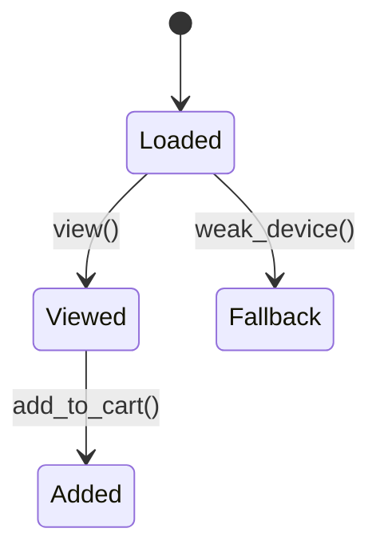

# AR/VR Menu Module

## State Machine

```mermaid
stateDiagram-v2
    [*] --> Loaded
    Loaded --> Viewed: view()
    Viewed --> Added: add_to_cart()
    Loaded --> Fallback: weak_device()
```

## Sample API Usage
```bash
# Fetch asset
curl /api/v1/ar/menu/{id}
# Log interaction
curl -X POST /api/v1/ar/interactions -d '{"item_id":"123"}'
```
