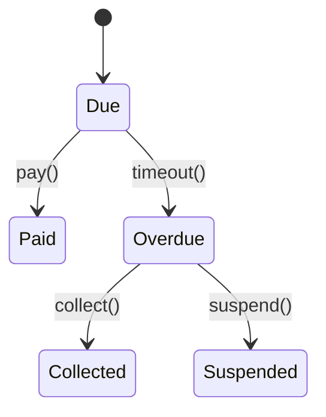

# Billing Module



## API
- `POST /api/v1/billing/invoices` – issue invoice
- `GET /api/v1/billing/history/{tenant}` – list invoices

```php
// Issue invoice
$response = Http::post('/api/v1/billing/invoices', [
    'tenant_id' => 't1',
    'modules' => [['name' => 'core', 'amount' => 100]],
]);
```
