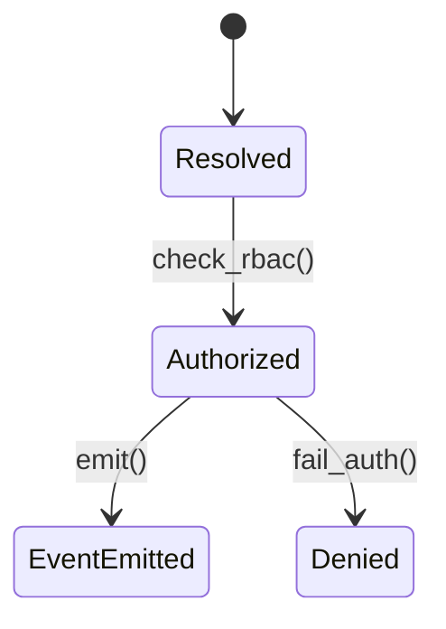

# Core Module

The Core module provides multi-tenancy, RBAC, event bus, feature flags and theming.



Example of emitting an event:

```php
EventBus::emit('core.tenant.resolved@v1', ['tenant_id' => $tenantId]);
```
