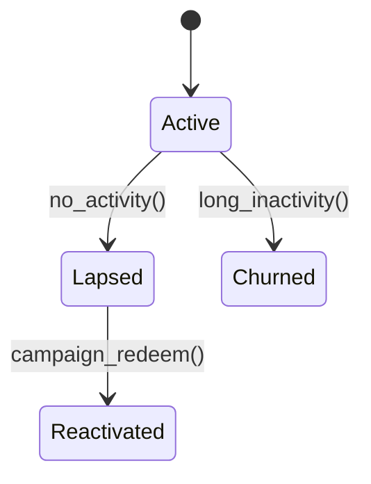

# CRM Module

This module manages customer segments, campaigns and win-back journeys.



## API
- `POST /v1/crm/campaigns` create a campaign for a segment.
- `GET /v1/crm/segments` list available segments.

## Events
- Emits `crm.campaign.sent@v1` when a campaign is dispatched.
- Consumes `pos.order.paid@v1` to update customer RFM.

## Code Example
```php
$campaign = Campaign::create([...]);
SendCampaignJob::dispatch($campaign);
```
