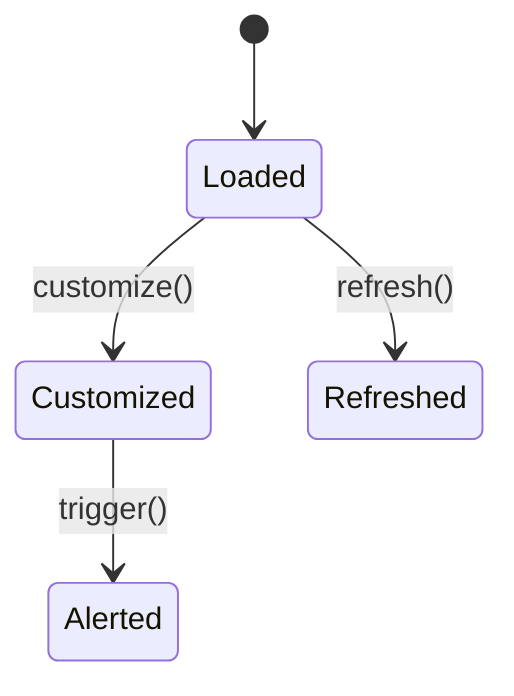

# Dashboard Module

Provides real-time KPIs, charts and alerts for tenants.

## API

```http
GET /api/v1/dashboard/kpis?time_window=1h
PATCH /api/v1/dashboard/customize
```

## State Machine



## Events

Emits `dashboard.alert.triggered@v1` and listens for `pos.order.paid@v1`.

## Sample Usage

```php
DashboardAlertTriggered::dispatch('sales', 1000);
```
