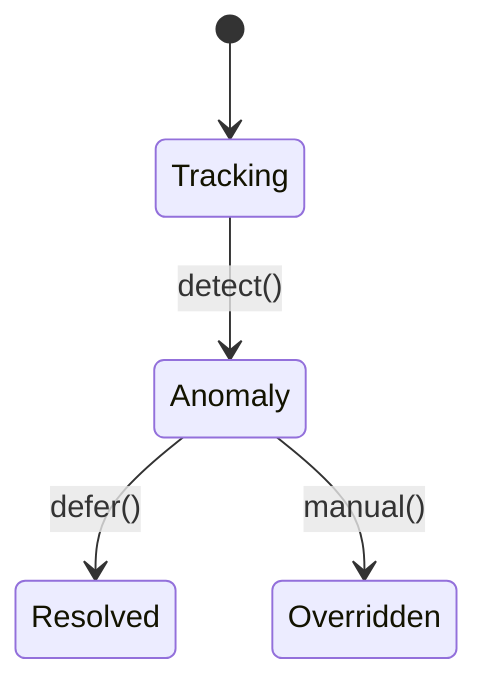

# Energy Tracking Module

The Energy module records meter logs and automatically detects usage anomalies.



## API

### POST `/api/v1/energy/logs`
```json
{"kwh": 10}
```
Response:
```json
{"log_id": "01HXYZ"}
```

### GET `/api/v1/energy/anomalies`
Returns a list of anomalous logs for the tenant or `404` if none.
