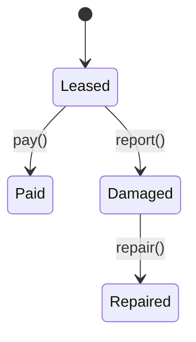

# Equipment Leasing

The Equipment Leasing module manages equipment contracts, payments and uptime reporting within EliteSaaS.

## State Machine



## API

### Sign a Lease

```http
POST /v1/equipment/leases
{
  "equipment_id": "eq-1"
}
```

### Fetch Uptime

```http
GET /v1/equipment/uptime/{lease_id}
```

The module emits `equipment.lease.signed@v1` and consumes `billing.payment.received@v1` events.
