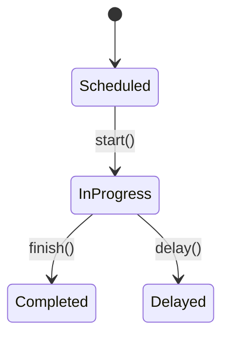

# Equipment Maintenance Module



## Ticket API

- `POST /api/v1/maintenance/tickets`
- `PATCH /api/v1/maintenance/tickets/{id}/complete`

## Domain Event

`maintenance.ticket.created@v1`

```json
{"ticket_id":"1717","equipment_id":"eq2"}
```
