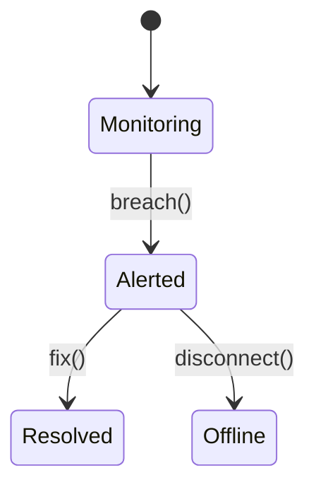

# Equipment Monitoring

Telemetry collection and alerting for connected equipment.

## State Machine



## API

- `POST /v1/monitoring/data`
- `GET /v1/monitoring/alerts`

```php
Http::post('/api/v1/monitoring/data', [
    'tenant_id' => $tenant,
    'equipment_id' => $equipment,
    'metric' => 'pressure',
    'value' => 22.5,
]);
```

## Events

Emits `monitoring.alert.raised@v1`:

```json
{"event":"monitoring.alert.raised","data":{"equipment_id":"1818","metric":"pressure"}}
```
