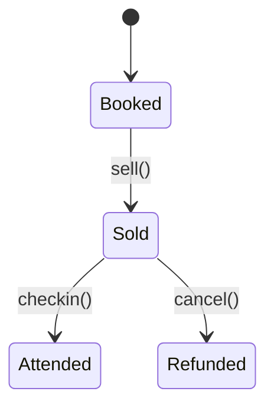

# Event Management Module

This module handles events, tickets and waitlists.



## API

- `POST /api/v1/events/tickets` – purchase a ticket.
- `GET /api/v1/events/{id}/waitlist` – view waitlist.

```php
$response = Http::post('/api/v1/events/tickets', ['event_id' => $eventId]);
```
