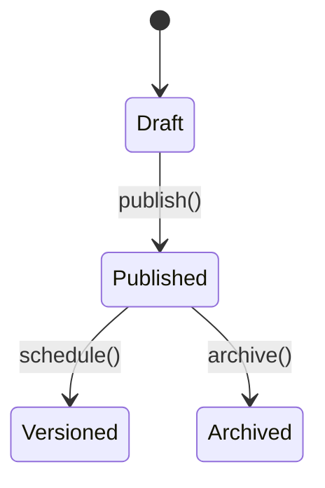

# Floor Plan Designer Module

The Floor Plan Designer module provides drag-and-drop floor layouts with zones, versioning and heatmap support.

## State Machine



## Updating a Floorplan

```php
$response = \Http::patch('/api/v1/floorplan/'.$planId, [
    'json_data' => ['tables' => [1,2]],
]);
```

The module dispatches the `floorplan.updated@v1` event on changes.
