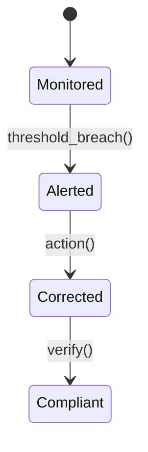

# Food Safety Module

Tracks temperature logs, HACCP actions and alerts.

## State Machine


## API
- `POST /v1/foodsafety/logs`
- `GET /v1/foodsafety/incidents`

## Event Example
```json
{"event":"foodsafety.breach.detected","data":{"item_id":"1313","temp":10}}
```
