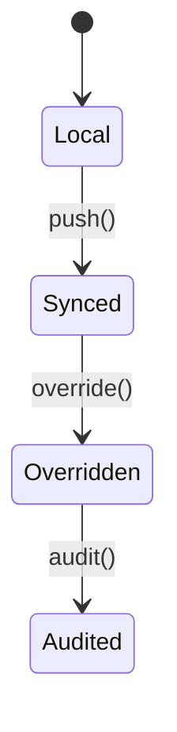

# Franchise Module

```mermaid
stateDiagram-v2
    [*] --> Local
    Local --> Synced: push()
    Synced --> Overridden: override()
    Overridden --> Audited: audit()
```

## API

- `PATCH /v1/franchise/templates/{template}`
- `GET /v1/franchise/reports/aggregate`
