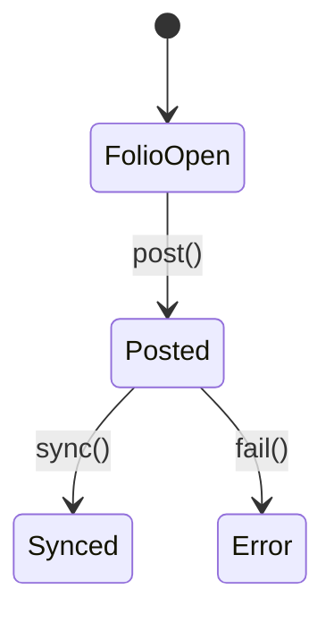

# Hotel PMS Module

Handles guest folios, postings and reservation syncs. Charges can be posted to rooms and reservation data is synchronized from external PMS systems via adapters.

## State Diagram


## API
- `POST /api/v1/pms/folios` – post a charge to a folio.
- `GET /api/v1/pms/sync/reservations` – run reservation sync.

### Example
```php
$response = Http::post('/api/v1/pms/folios', [
    'guest_id' => '2121',
    'amount' => 30,
]);
```
