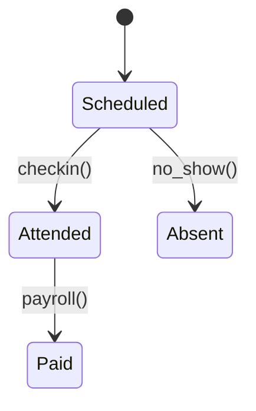

# HRJobs Module

The HRJobs module manages shifts, attendance and payroll. It exposes a small API for scheduling shifts and retrieving payroll data.



### API

- `POST /v1/hr/shifts` – schedule a shift
- `POST /v1/hr/shifts/{shift}/checkin` – register attendance
- `GET /v1/hr/payroll/{period}` – fetch payroll for a period

### Domain Event

```json
{"event":"hr.shift.completed@v1","data":{"shift_id":"808","employee_id":"emp1"}}
```

