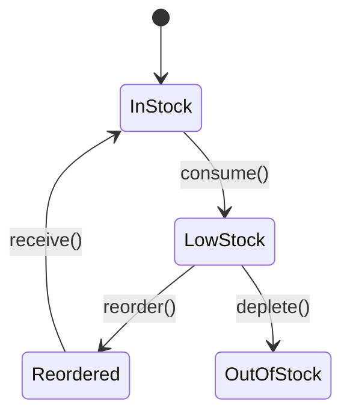

# Inventory Module


```mermaid
stateDiagram-v2
    [*] --> InStock
    InStock --> LowStock: consume()
    LowStock --> Reordered: reorder()
    Reordered --> InStock: receive()
    LowStock --> OutOfStock: deplete()
```

Example event:
```json
{"event":"inventory.stock.updated","data":{"item_id":"1","quantity":100}}
```
