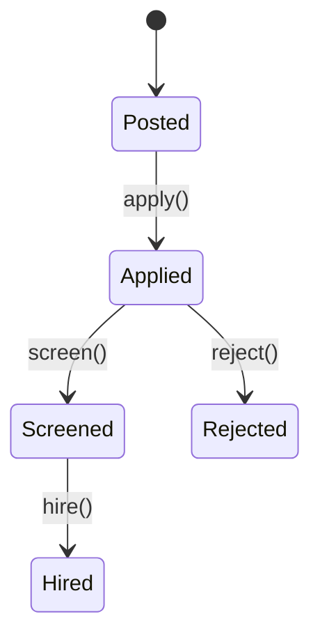

# Jobs Module

Manages job postings and applicant pipelines for EliteSaaS.

## API
- `POST /api/v1/jobs/applications` – submit application with CV.
- `GET /api/v1/jobs/postings` – list open job postings.

## State Machine


## Domain Event
```php
ApplicationReceived::dispatch($application); // emits jobs.application.received@v1
```
