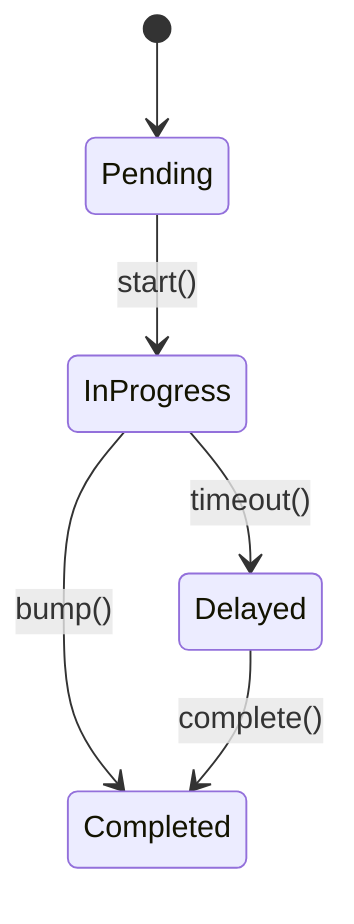

# Kitchen Display System (KDS)

The KDS module consumes POS order events and exposes an API for managing kitchen tickets.

### API
- `POST /v1/kds/tickets` – create ticket from an order.
- `PATCH /v1/kds/tickets/{id}/bump` – mark ticket complete and broadcast `kds.ticket.completed`.

### Events
Emits `kds.ticket.completed` with `{ticket_id, station}` payload.
Consumes `pos.order.paid` to create tickets.
