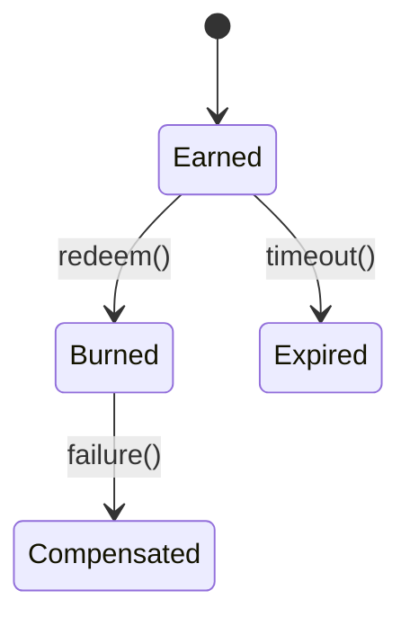

# Loyalty Module

The Loyalty module manages earn, burn and expiry of customer points.

## State Machine


## Domain Events
- **Emitted**: `loyalty.points.earned@v1` with payload `{customer_id: string, points: int}`
- **Consumed**: `pos.order.paid@v1`

## API
- `POST /api/v1/loyalty/redeem` – redeem points.
- `GET /api/v1/loyalty/balance/{customer_id}` – fetch balance.

## Example
```php
// Redeem
$resp = Http::post('/api/v1/loyalty/redeem', [
    'customer_id' => 'cust-1',
    'points' => 10,
]);
```
