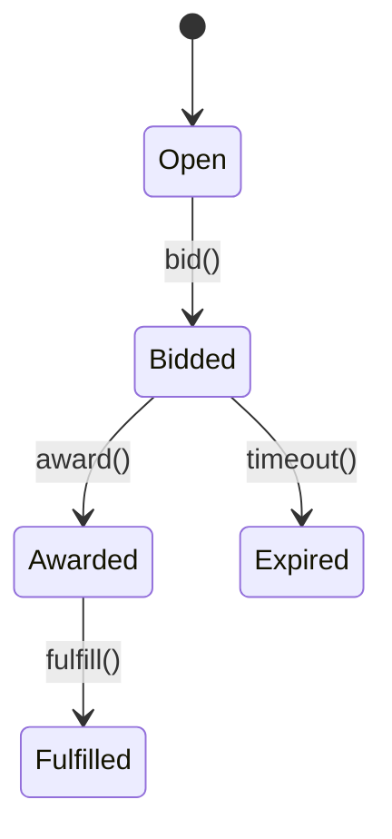

# Marketplace Module

The Marketplace module provides supplier storefronts, listings and bid workflows.

## Events
- `marketplace.bid.awarded@v1`

## API
- `POST /api/v1/marketplace/bids`
- `GET /api/v1/marketplace/stores/{supplier}`

