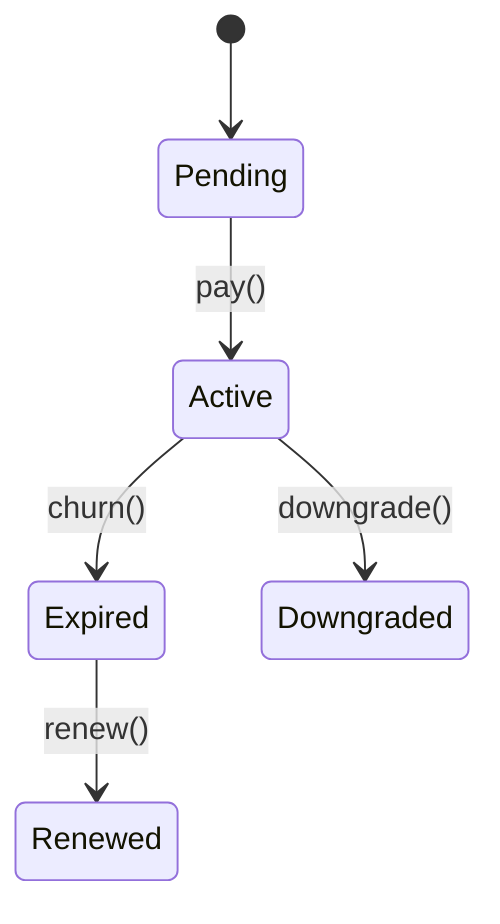

# Membership Module



## API
- `PATCH /api/v1/membership/{id}` – upgrade tier
- `GET /api/v1/membership/perks/{tier}` – list perks for tier

```php
// Upgrade membership tier
$response = Http::patch('/api/v1/membership/'.$id, ['tier' => 'gold']);
```
