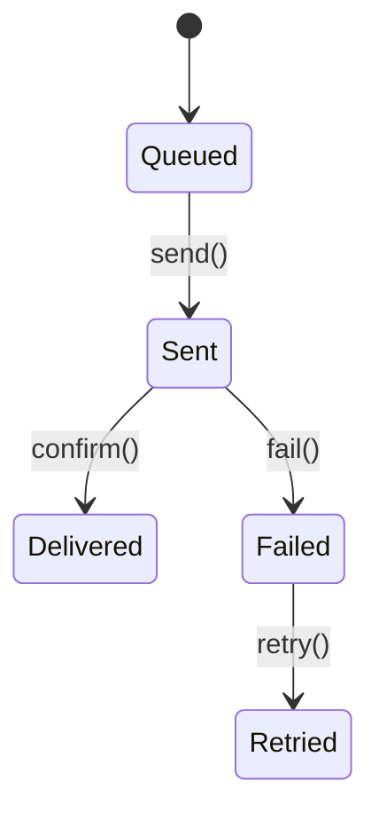

# Notifications Module

Handles templated, rate-limited notifications with channel fallbacks and chunked delivery.

## State Machine


## API
- `POST /api/v1/notifications` send notifications
- `PATCH /api/v1/notifications/preferences` update preferences

## Example
```php
$notifId = app(\Modules\Notifications\Services\NotificationSender::class)
    ->send($template, ['user@example.com']);
```
