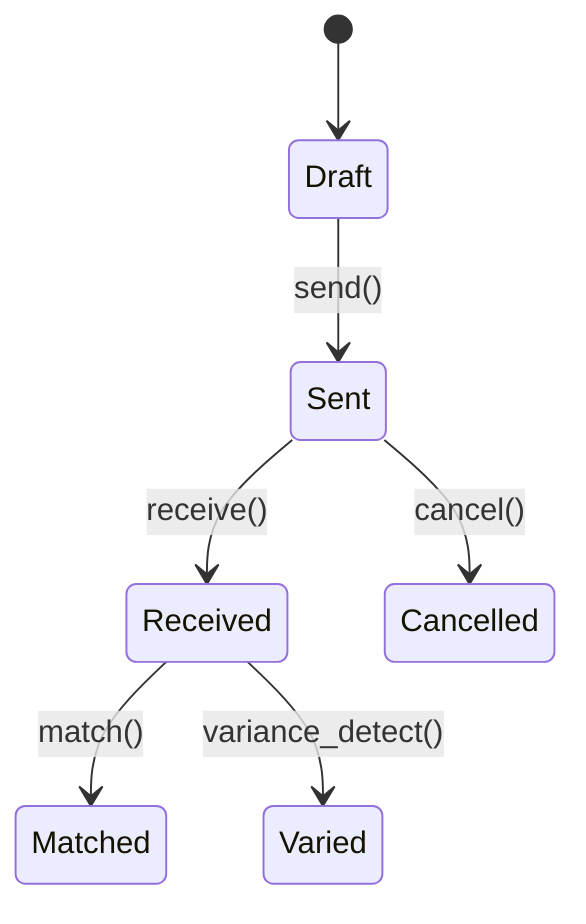

# Procurement Module

This module manages RFQs, bids, purchase orders (PO) and goods received notes (GRN). It exposes a REST API and emits domain events.

## State Machine



## Example Event Payload

```json
{"event":"procurement.po.created","data":{"po_id":"101","supplier_id":"sup1"}}
```
