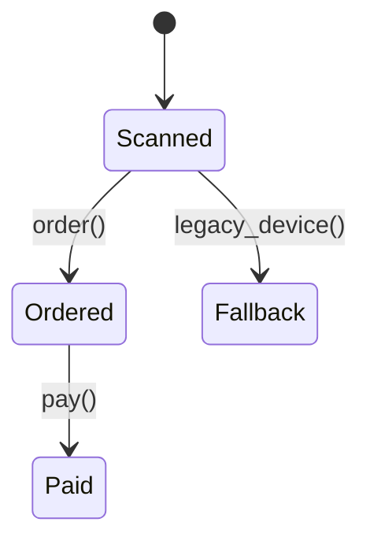

# QR Ordering Module

```mermaid
stateDiagram-v2
    [*] --> Scanned
    Scanned --> Ordered: order()
    Ordered --> Paid: pay()
    Scanned --> Fallback: legacy_device()
```

This module allows customers to scan a table QR code, view a live menu and place orders that are routed to POS and KDS systems.
