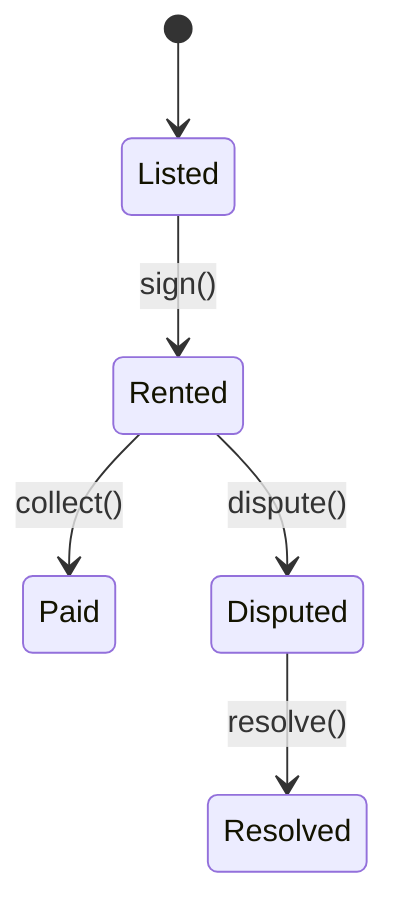

# Rentals Module



## API
- `POST /api/v1/rentals/contracts` – create contract
- `GET /api/v1/rentals/occupancy` – current occupancy rate

```php
// Create contract
$response = Http::post('/api/v1/rentals/contracts', [
    'space_id' => 'listing-1',
]);
```
