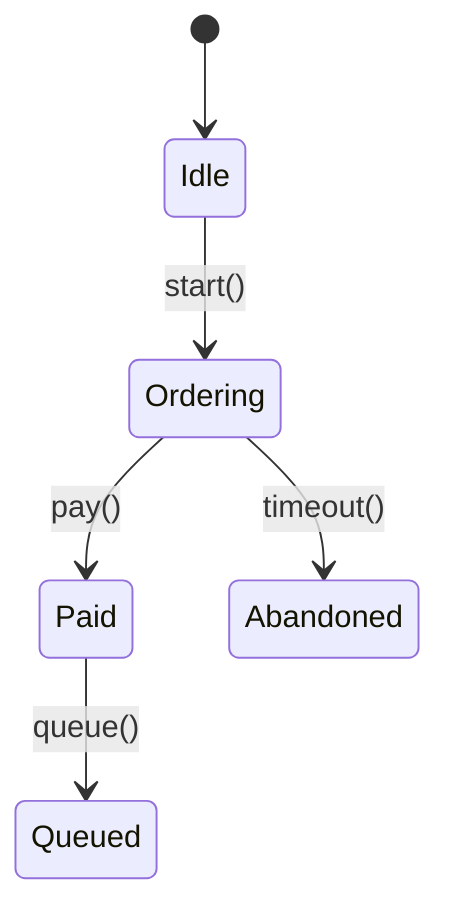

# Self-Service Kiosk Module

Cashier-less self-ordering with idle loops and touch-first UI.

## API
- `POST /v1/kiosk/orders`
- `GET /v1/kiosk/status/{id}`

## Events
- `kiosk.order.completed@v1`

```mermaid
stateDiagram-v2
    [*] --> Idle
    Idle --> Ordering: start()
    Ordering --> Paid: pay()
    Ordering --> Abandoned: timeout()
    Paid --> Queued: queue()
```
