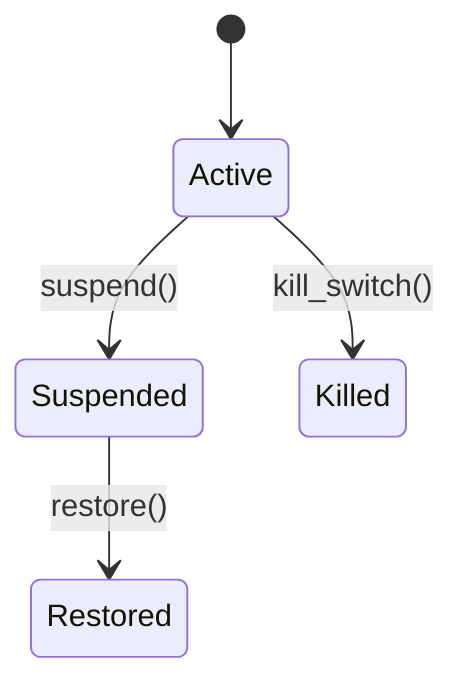

# SuperAdmin Module

The SuperAdmin module provides global controls for modules and tenants. It exposes kill-switches, broadcasts and health monitoring.

## API
- `PATCH /v1/superadmin/modules` – toggle module availability.
- `POST /v1/superadmin/broadcasts` – queue a global broadcast.

## State Machine


## Domain Event
```json
{"event":"superadmin.module.disabled@v1","data":{"module":"pos","tenant_id":"uuid"}}
```

## Example
```php
Flag::updateOrCreate(['module' => 'pos', 'tenant_id' => null], ['enabled' => false]);
```
