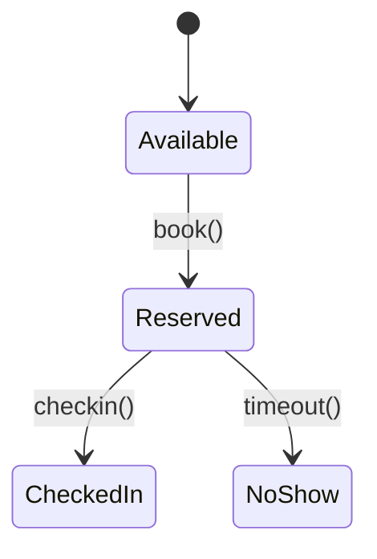

# Table Reservations Module

The Table Reservations module manages table booking slots, check-ins, waitlists and automatic release of no-shows within EliteSaaS.



## Booking API

```http
POST /api/v1/reservations
{ "time": "2024-01-01 10:00:00", "table_id": "table1" }
```

## Check-in API

```http
PATCH /api/v1/reservations/{id}/checkin
```

After each booking the event `reservations.booked@v1` is emitted.
