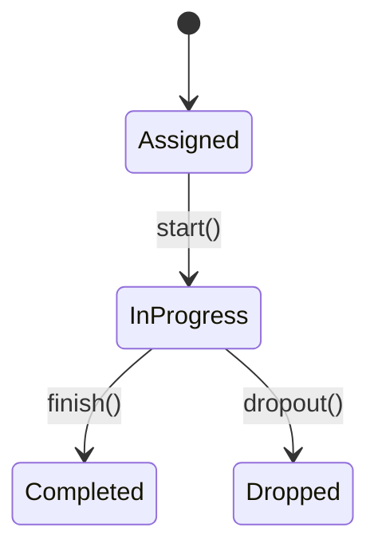

# Training Module



## Domain Events
- **Emits** `training.course.completed@v1`:
```json
{"course_id":"1010","employee_id":"emp2"}
```
- **Consumes** `hr.onboarded@v1`

## API
- `PATCH /api/v1/training/progress`
- `GET /api/v1/training/courses/{employee_id}`
